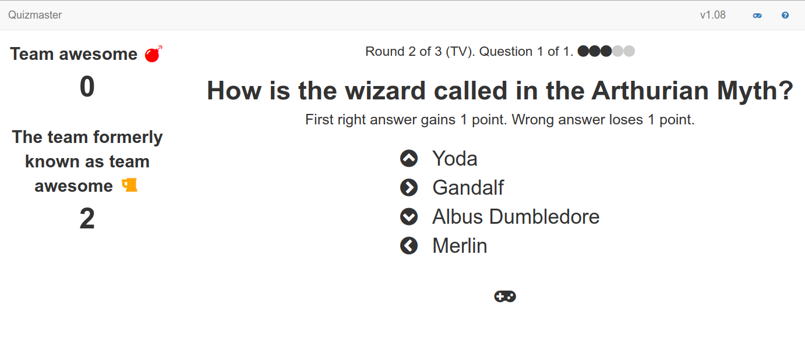

Quizmaster
===============

[](https://travis-ci.org/nymanjens/quizmaster)

A web-app for conducting a quiz, including a page for players to enter their answers.

## Screenshot



## Installation from release

- Download the [latest release](https://github.com/nymanjens/quizmaster/releases)
- Unpack the archive and open a terminal in the unpacked folder
- Run `bin/server` (UNIX) or `bin/server.bat` (Windows)
- Browse to http://localhost:9000

## Installation with Docker

- Run the following command:

```
docker run nymanjens/quizmaster:latest bin/server
```

- Browse to `http://<ip_address>:9000`

## Configuration

- `conf/application.conf`:
    - `play.i18n.langs`: The client language, `"en"` and `"nl"` are supported
    - `app.development.loadDummyData`: If this is true: Start with 4 teams already configured (Team A, Team B, Team C, Team D)

- `conf/quiz/quiz-config.yml`:<br>
  Configure your quiz here (questions, choices, answers, images, ...)

## Play

### How to set up

Follow these steps to host a quiz:

- Make your own quiz by editing `conf/quiz/quiz-config.yml`. You can test your quiz by starting a
  local server with it (see the installation section above)
- Host the server somewhere accessible to all players
- During a quiz, share the link to your server with all players. You
  can go to the same page and unlock the master controls via the padlock icon (if you configured a
  `masterSecret` in `quiz-config.yml`). The important pages during the quiz:
    - The player's answer submission page: This is what players use to input their answers.
    - The quiz page: This is the screen to show to all players. It shows the questions, player
      scores and plays audio and video.
    - The master page: This is a screen only for the quizmaster. It allows you to score player
      answers and generally control the quiz flow.

### Shortcuts

- **Quiz navigation**
  - `left/right`: Go to the previous/next step of the question
  - `alt + left/right`: Go to the previous/next question
  - `alt + shift + left/right`: Go to the previous/next round
- **Tools during question**
  - `spacebar`: Pause and resume the timer
  - `shift + r`: Play the current audio/video file from the beginning
  - `shift + =/-`: Add/subtract 30 seconds from the current timer
  - `alt + enter`: Toggle enlarged image (if there is a visible image)
  - `a`: toggle the answer to be visible in the master view (http://localhost:9000/app/master)
- **Scoring**
  - `1/2/3/.../0`: Increase the score of team 1, 2, ..., 10 by one point
  - `shift + 1/2/3/.../0`: Decrease the score of team 1, 2, ..., 10 by one point
